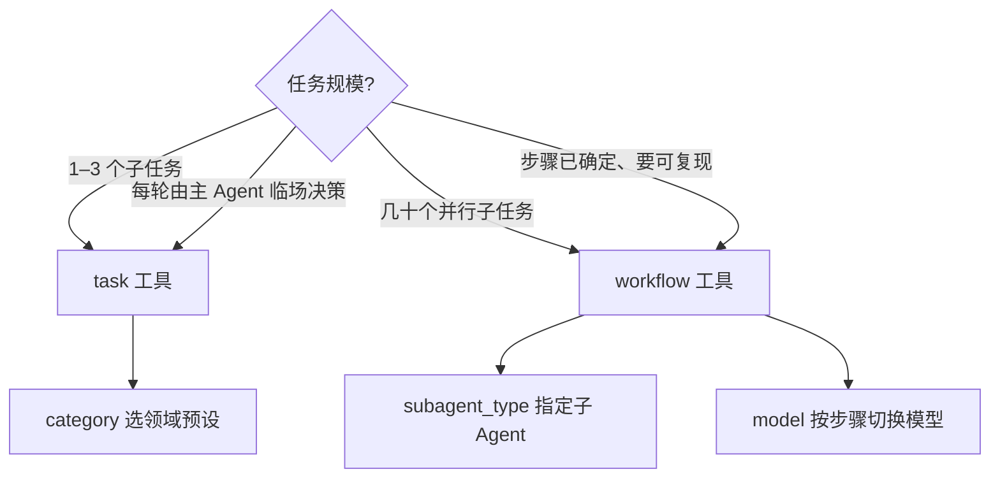

# Dynamic Workflow 使用指南

Dynamic Workflow 让你用一段 JavaScript 脚本，把几十个独立子任务编排成一条确定性流水线。脚本在后台运行，主会话保持响应；你可以随时打开协调会话查看实时进度，结束后自动收到汇总通知。

与 `task` 工具的区别：`task` 适合「这一轮让主 Agent 决定派谁」；workflow 适合「步骤已经想清楚，用脚本一次性 fan-out / fan-in」。

---

## 什么时候用

| 场景 | 推荐方式 |
|------|----------|
| 改一个文件、修一个 bug | 直接对话或 `task` |
| 两三个独立子任务 | `task` + `run_in_background` |
| 全库审计、大规模迁移、多视角交叉审查 | **workflow** |
| 几十个并行调研，最后汇总 | **workflow** |
| 用户明确说「跑个 workflow / ultracode」 | **workflow** |

**触发方式：**

- 在对话里说 `workflow` 或 `ultracode`（主会话自动引导）
- 输入 `/workflow` 命令，让 Agent 帮你写脚本并启动
- 直接让 Agent 调用 `workflow` 工具

---

## 核心能力一览

| 能力 | 说明 |
|------|------|
| **脚本编排** | `agent()`、`parallel()`、`pipeline()`、`phase()` 组合多步流程 |
| **`subagent_type`** | 为每个子任务指定真实子 Agent（如 `explore`、`oracle`、`general`） |
| **`model` 覆盖** | 为单个子任务切换模型规格（如 `openai/gpt-5.4 high`） |
| **`schema` 结构化输出** | 子 Agent 返回 JSON 对象，脚本直接当变量用 |
| **后台运行** | 默认立即返回 `run_id`，不阻塞主会话 |
| **实时进度** | 协调会话中的 checkbox 看板 |
| **完成通知** | 结束时父会话收到一条汇总（来自脚本 `return`） |

---

## 快速上手

主 Agent 会调用 `workflow` 工具，传入一段原始 JavaScript（不要包 markdown 代码块）：

```js
export const meta = {
  name: 'inspect_project',
  description: '扫描仓库结构并生成模块摘要',
}

phase('Scan')
const inventory = await agent(
  '列出 ' + cwd + ' 下的主要目录和入口文件',
  { label: 'repo inventory', subagent_type: 'explore' }
)

phase('Analyze')
const summary = await agent(
  '根据以下清单写模块摘要：\n' + inventory,
  { label: 'module summary', model: 'openai/gpt-5.4 medium' }
)

return { inventory, summary }
```

**三条硬性规则：**

1. 第一行必须是 `export const meta = { name, description }`
2. 至少调用一次 `agent()`
3. 脚本必须以显式 `return` 结束（否则完成通知里没有结果摘要）

---

## 指定子 Agent：`subagent_type`

每个 `agent()` 可以单独指定由哪个子 Agent 执行。系统会在运行时从 `client.app.agents()` 校验，只路由 `mode` 为 `subagent` 或 `all` 的 Agent。

```js
// 用 explore 做代码库扫描
const patterns = await agent('找出所有 auth 相关文件', {
  label: 'auth scan',
  subagent_type: 'explore',
})

// 用 oracle 做架构审查
const review = await agent('审查以下发现的架构风险：\n' + patterns, {
  label: 'arch review',
  subagent_type: 'oracle',
})

// 省略 subagent_type 时，使用配置的 default_subagent（默认 general）
const summary = await agent('汇总以上结果', { label: 'summary' })
```

**常用子 Agent：**

| subagent_type | 适合做什么 |
|---------------|------------|
| `explore` | 快速代码库搜索、模式定位 |
| `librarian` | 文档查找、多仓库分析 |
| `oracle` | 架构决策、代码审查（只读） |
| `general` | 通用执行（默认） |

你也可以使用自己在 `.opencode/agents/` 下定义的自定义 Agent，只要它的 `mode` 允许作为子 Agent 被调用。

---

## 切换模型规格：`model`

除了选「谁来做」，还可以为单个子任务覆盖「用什么模型」。格式为 `provider/model`，可带 variant 后缀：

```js
phase('Deep analysis')
const architecture = await agent('分析支付模块的耦合点', {
  label: 'payment arch',
  subagent_type: 'oracle',
  model: 'openai/gpt-5.4 xhigh',    // 高推理规格
})

phase('Quick pass')
const typos = await agent('检查 README 拼写', {
  label: 'readme lint',
  model: 'openai/gpt-5.4-mini',     // 轻量模型
})

phase('Frontend review')
const ui = await agent('审查 dashboard 组件可访问性', {
  label: 'a11y review',
  subagent_type: 'general',
  model: 'google/gemini-3.1-pro high',
})
```

**组合策略示例：**

- 扫描用 `explore` + 默认快模型
- 深度推理用 `oracle` + `xhigh` / `max` variant
- 文档整理用 `writing` 类 Agent + `gemini-3-flash`
- 同一条 workflow 里，不同阶段可以用完全不同的模型规格

不传 `model` 时，子 Agent 使用其自身配置的默认模型链。

---

## 编排 API

### `agent(prompt, opts?)`

启动一个子 Agent，等待完成后返回文本或结构化对象。

| opts 字段 | 类型 | 说明 |
|-----------|------|------|
| `label` | string | 进度看板上的短标签（2–5 词，必填） |
| `subagent_type` | string | 子 Agent 名称 |
| `model` | string | `provider/model` 或 `provider/model variant` |
| `phase` | string | 覆盖当前阶段名 |
| `schema` | object | JSON Schema，子 Agent 返回解析后的对象 |

失败时返回 `null`（不会终止整个 workflow），合成结果前请检查。

### `parallel(thunks)`

并发执行多个子任务。传入**函数数组**，不是 Promise 数组：

```js
const files = ['auth.ts', 'api.ts', 'db.ts']

const reviews = await parallel(
  files.map(file => () =>
    agent('审查 ' + file + ' 的安全问题', {
      label: 'review ' + file,
      subagent_type: 'oracle',
      model: 'openai/gpt-5.4 high',
    })
  )
)

// reviews[i] 对应 files[i]，顺序与输入一致
return { files, reviews }
```

### `pipeline(items, ...stages)`

每个 item 依次经过多个 stage，不同 item 之间并发：

```js
const modules = ['auth', 'billing', 'notify']

const reports = await pipeline(
  modules,
  async (name) => await agent('扫描 ' + name + ' 模块', {
    label: 'scan ' + name,
    subagent_type: 'explore',
  }),
  async (scanResult, name) => await agent('写 ' + name + ' 风险报告：\n' + scanResult, {
    label: 'report ' + name,
    subagent_type: 'oracle',
    model: 'openai/gpt-5.4 xhigh',
  })
)
```

### `phase(title)` / `log(message)`

- `phase('Scan')` 更新协调会话中的当前阶段
- `log('...')` 写入运行日志（`workflow_output` 可查）

### 其他全局

| 全局 | 说明 |
|------|------|
| `args` | `workflow` 工具传入的参数对象 |
| `cwd` / `process.cwd()` | 项目根目录 |

---

## 结构化输出：`schema`

需要机器可读结果时，传入 JSON Schema（不是 TypeScript 类型）：

```js
const stats = await agent('统计 src/ 下各目录的文件数', {
  label: 'dir stats',
  subagent_type: 'explore',
  schema: {
    type: 'object',
    properties: {
      total: { type: 'number' },
      byDir: {
        type: 'object',
        additionalProperties: { type: 'number' },
      },
    },
    required: ['total', 'byDir'],
  },
})

// stats 是解析后的对象，可直接使用
return { totalFiles: stats.total, breakdown: stats.byDir }
```

---

## 子任务之间如何传参

子 Agent **看不到**脚本里的变量，也**不共享**彼此的上下文。编排层通过 JavaScript 变量串联结果：

```js
const raw = await agent('...', { label: 'step 1', subagent_type: 'explore' })
const refined = await agent('基于以下内容精炼：\n' + raw, {
  label: 'step 2',
  model: 'openai/gpt-5.4 medium',
})
return refined
```

每个 `agent()` 的 prompt 里要自带足够上下文（文件路径、约束、前序结果）。

---

## 查看进度与结果

### 实时进度（推荐）

workflow 启动后，在 TUI 中：

1. 输入 `/session`
2. 选择名为 **「工作流: \<name\>」** 的会话
3. 查看 checkbox 进度看板和每个子 Agent 的完整输出

> workflow 工具卡片在 TUI 中不可点击；进度入口是协调会话。

### 完成通知

workflow 结束后，父会话自动收到一条通知，包含脚本 `return` 值的摘要。主 Agent 不需要轮询等待。

### 手动查询

| 工具 | 用途 |
|------|------|
| `workflow_output` | 查询 run 状态、阶段、各 agent 进度、最终结果 |
| `workflow_cancel` | 取消指定 run，或 `all=true` 取消当前会话所有活跃 run |

仅在用户明确要求查看中间状态时使用 `workflow_output`；默认应等待完成通知。

---

## 完整示例：多 Agent + 多模型审查

```js
export const meta = {
  name: 'security_audit',
  description: '全库安全审计：扫描、深度分析、汇总',
  phases: [{ title: 'Scan' }, { title: 'Analyze' }, { title: 'Report' }],
}

phase('Scan')
const fileList = await agent(
  '列出所有处理用户输入的 API 路由文件',
  { label: 'find endpoints', subagent_type: 'explore' }
)

phase('Analyze')
const findings = await parallel(
  ['injection', 'authz', 'secrets'].map(topic => () =>
    agent(
      '针对以下文件做 ' + topic + ' 专项检查：\n' + fileList,
      {
        label: topic + ' check',
        subagent_type: 'oracle',
        model: 'openai/gpt-5.4 xhigh',
      }
    )
  )
)

phase('Report')
const report = await agent(
  '将以下三项检查结果合成一份执行摘要：\n' +
  JSON.stringify({ injection: findings[0], authz: findings[1], secrets: findings[2] }),
  {
    label: 'final report',
    model: 'anthropic/claude-sonnet-4-6',
  }
)

return { report, findings }
```

---

## 配置

在 `.opencode/oh-my-openagent.jsonc`（或兼容的 `oh-my-opencode.jsonc`）中：

```jsonc
{
  "dynamic_workflow": {
    "enabled": true,                    // 默认 true；false 时禁用全部 workflow 工具
    "default_subagent": "general",      // agent() 省略 subagent_type 时的默认值
    "max_concurrency": 16,              // 单条 workflow 内 agent() 最大并发（1–32）
    "max_agents_per_run": 1000,         // 单条 workflow 内 agent() 调用上限
    "notify_on_complete": true,         // 完成时通知父会话
    "persist_scripts": false,           // true 时成功后写入 .opencode/workflows/
    "scripts_dir": ".opencode/workflows"
  }
}
```

禁用单个工具：

```jsonc
{
  "disabled_tools": ["workflow_output"]
}
```

禁用 `/workflow` 命令：

```jsonc
{
  "disabled_commands": ["workflow"]
}
```

---

## 脚本限制

脚本在 VM 沙箱中运行，为保证安全与可复现：

**允许：** 普通 JavaScript 逻辑、`Math`（不含 `Math.random`）

**禁止：**

- TypeScript 语法
- `import` / `require`
- 文件系统、网络 API
- `Date.now()`、`Math.random()`、`new Date()`

---

## workflow vs task 怎么选



| 维度 | `task` | `workflow` |
|------|--------|------------|
| 编排方式 | 主 Agent 每轮决策 | JS 脚本（确定性） |
| 选子 Agent | `subagent_type` 或 `category` | `opts.subagent_type` |
| 选模型 | category 自动映射 | `opts.model` 按步骤覆盖 |
| 进度查看 | 工具卡片可点击 | `/session` 打开协调会话 |
| 适合规模 | 少量委派 | 大规模 fan-out |

两者可以混用：简单步骤用 `task`，大规模编排用 `workflow`。

---

## 常见问题

### 完成通知里没有结果？

脚本缺少显式 `return`。尾部表达式不算结果，必须写 `return { ... }` 或 `return summaryText`。

### 某个子任务失败了，整个 workflow 会怎样？

该分支返回 `null`，其余分支继续。请在合成前检查 `null`。

### 子 Agent 说「看不到之前的上下文」？

正常现象。把前序结果写进下一个 `agent()` 的 prompt 字符串。

### 指定的 subagent_type 报错？

名称必须在当前环境的可用 Agent 列表中，且 `mode` 为 `subagent` 或 `all`。错误信息会列出可用列表。

### 重启后还能查旧 run 吗？

不能。run 状态存在内存中，进程重启后 `workflow_output` 找不到旧 run。

---

## 进一步阅读

- [编排系统指南](./orchestration.md) — Prometheus / Atlas 计划执行体系
- [功能参考](../reference/features.md) — 全部 Agent、Category、工具列表
- [架构说明](../superpowers/specs/2026-06-03-dynamic-workflow-design.md) — 开发者向 UML 4+1 设计文档
