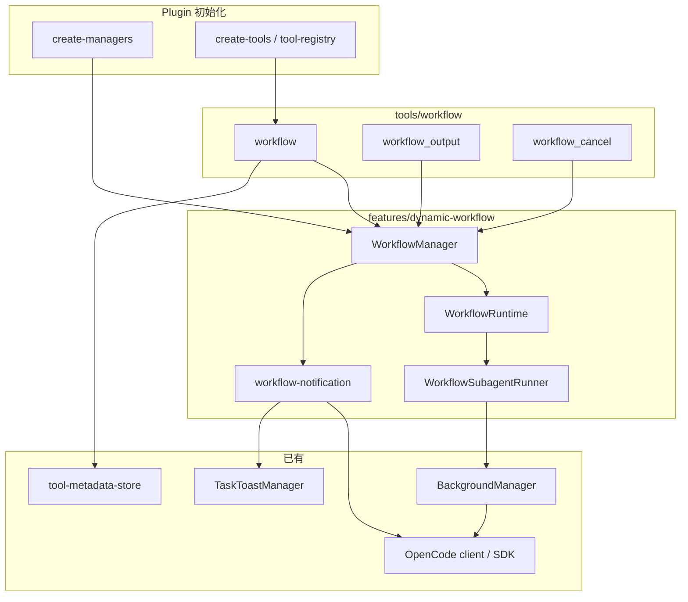
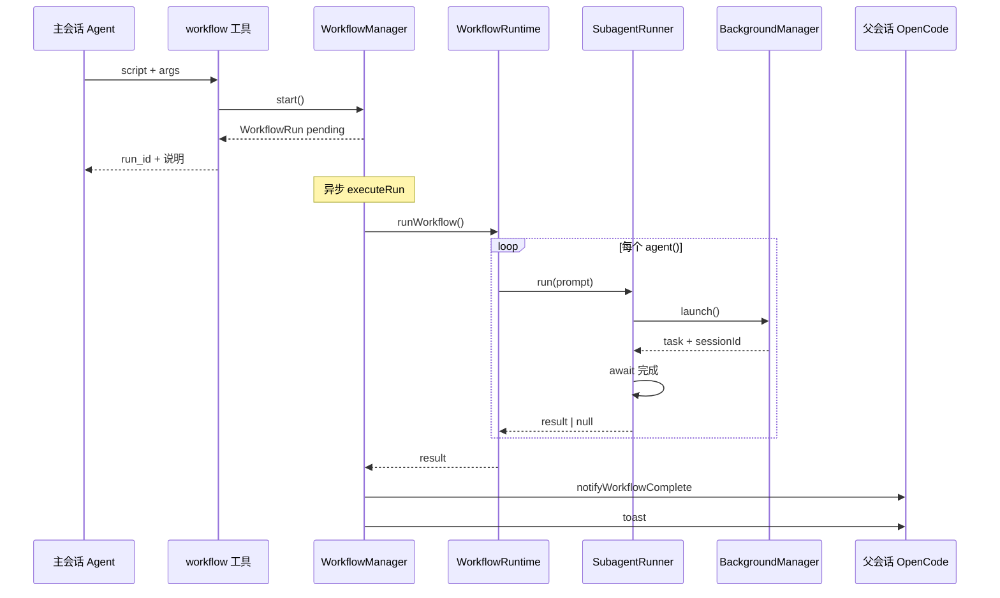
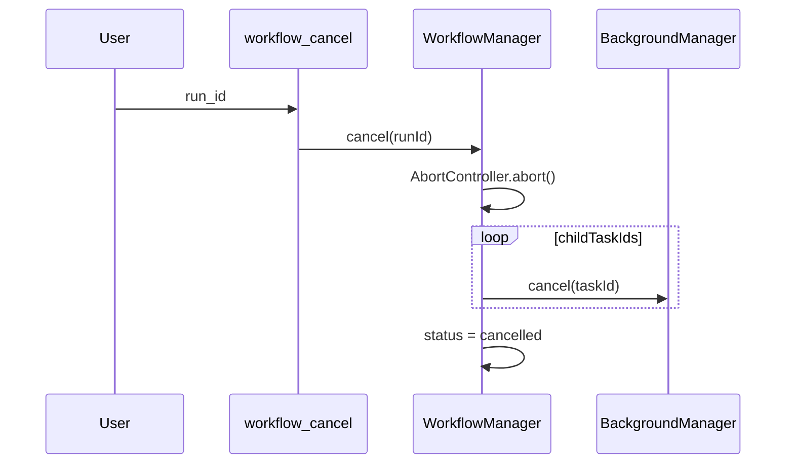

# Dynamic Workflow 设计说明

**状态:** Draft  
**日期:** 2026-06-03  
**参考:** [Claude Code Dynamic Workflows](https://code.claude.com/docs/en/workflows)、[pi-dynamic-workflows](https://github.com/earendil-works/pi-dynamic-workflows)（本地参考实现）

---

## 1. 目标

在 **oh-my-opencode** 插件中实现与 Claude Code **Dynamic Workflow** 语义对齐的能力：

1. 主 Agent 通过 **`workflow` 工具** 提交一段 JavaScript 编排脚本。
2. 脚本在 **独立 runtime** 中执行，**不阻塞** 主会话（默认后台运行）。
3. 运行期间用户可通过现有 OpenCode **Task / 后台任务 UI** 查看子 Agent 进度（`sessionId` 钻取）。
4. 整次 workflow **结束后** 向父会话发送 **一条汇总通知**（复用现有 `BackgroundManager` 通知链路）。

编排计划写在脚本里（`agent` / `parallel` / `pipeline` / `phase`），中间结果留在脚本变量，最终只有结构化结果进入主会话上下文。

---

## 2. 背景与问题

### 2.1 现有能力

| 能力 | 位置 | 局限 |
|------|------|------|
| 单次后台委托 | `task` + `BackgroundManager` | 无脚本级 fan-out/fan-in；计划由 LLM 逐轮决定 |
| 进度与钻取 | `metadata.sessionId` + Task UI | 单任务一条 session，无「一次 run 多 phase」聚合 |
| 完成通知 | `notifyParentSession` + `TaskToastManager` | 按 **background task** 粒度，非 workflow run |
| 并行编排提示 | `ultrawork` keyword hook | 仍是 LLM 编排，非可保存、可重跑的 JS |

### 2.2 pi-dynamic-workflows 可移植部分

- `parseWorkflowScript`（acorn AST + 确定性约束）
- `runWorkflow`（`node:vm` 沙箱 + `agent` / `parallel` / `pipeline`）
- 工具侧 prompt 规范与 snapshot 模型

### 2.3 pi 与 Claude Code 的差距（本设计要补齐）

| 项 | pi 现状 | 本设计目标 |
|----|---------|------------|
| 执行模式 | 工具 `execute` 内同步 `await` | 默认异步，立即返回 `run_id` |
| 子 Agent | Pi 内存 `WorkflowAgent` | OpenCode 子 session（`BackgroundManager` 或专用 spawner） |
| UI | Pi `onUpdate` + 自定义 render | metadata + `workflow_output` + 子 session 钻取 |
| 管理器 | 无 | `WorkflowManager` run 生命周期 |
| 持久化 / resume | 无 | Phase 2+；Phase 1 仅内存 |

---

## 3. 何时使用

与官方文档一致，建议在工具描述与文档中明确：

**适合 workflow：**

- 可分解的多步任务（审计、多视角 review、大范围 fan-out 研究）
- 需要 **可重跑** 的固定编排（保存脚本后反复执行）
- 中间结果量大，不应全部进入主会话 context

**不适合 workflow：**

- 单文件小改、一次 `read`/`edit` 即可
- 无法写成「至少一次 `agent()`」的静态脚本

**与 `task` 的分工：**

| | `task` | `workflow` |
|---|--------|------------|
| 编排者 | 主 Agent 每轮决策 | JS 脚本 |
| 规模 | 少量并行后台任务 | 数十～上百 `agent()`（受上限约束） |
| 可复用物 | category / agent 配置 | 脚本文件 + meta |
| 返回时机 | 立即（background）或阻塞（sync） | 默认立即（`run_id`） |

---

## 4. 范围

### Phase 1（MVP）

- `workflow` / `workflow_output` / `workflow_cancel` 三个工具
- `WorkflowManager` + `WorkflowRuntime` + `WorkflowSubagentRunner`
- 默认 `run_in_background: true`
- 子 agent 经 OpenCode session 执行，metadata 暴露 `sessionId`
- run 完成时父会话 **一条** 通知 + toast
- 配置项 `dynamic_workflow` + `disabled_tools` 支持
- 从 pi 移植 parser/runtime 单元测试

### Phase 2

- 脚本保存：`.opencode/workflows/{name}.js` 与 builtin command 包装
- keyword 触发（`workflow` / `ultracode` 类）可选注入
- `agent(..., { schema })` 结构化输出（依赖 OpenCode 侧能力评估）
- doctor 检查项

### Phase 3（依赖上游或长期）

- 同会话 pause/resume、agent 级重启（对齐 Claude `/workflows`）
- 富 UI phase 树（依赖 OpenCode TUI 扩展）
- 与上游原生 workflow API 共存时的薄封装模式

**Phase 1 明确不做：**

- 完整 `/workflows` TUI 复刻
- 跨 CLI 重启后的 run resume
- workflow 脚本内直接 `fs` / 网络（与 pi 一致，由子 agent 完成 IO）

---

## 5. 架构

### 5.1 模块划分

```
src/features/dynamic-workflow/
  index.ts                      # barrel
  types.ts                      # WorkflowRun, WorkflowAgentEntry, ...
  workflow-manager.ts           # 注册表、异步启动、取消、完成回调
  workflow-runtime.ts           # parseWorkflowScript, runWorkflow（从 pi 移植）
  workflow-subagent-runner.ts   # agent() -> OpenCode 子任务
  workflow-notification.ts      # 父会话通知文案与 promptAsync
  workflow-concurrency.ts       # run 内 agent 并发限制（默认 16）
  workflow-state.ts             # Map 存储
  constants.ts

src/tools/workflow/
  index.ts
  types.ts
  create-workflow.ts            # workflow 工具
  create-workflow-output.ts
  create-workflow-cancel.ts
  format-run-status.ts
  format-run-result.ts
```

### 5.2 依赖关系



### 5.3 与 BackgroundManager 的关系

- **不**把 workflow 逻辑塞进 `BackgroundManager` 类文件。
- 每个 `agent()` 调用 **委托** `BackgroundManager.launch()`（或内部 await 其完成），作为子执行单元。
- Workflow 使用 **独立并发池**（见 5.6），避免与普通 `task` 后台任务抢同一 `provider/model` 的 5 槽。

---

## 6. 核心类型与 API

### 6.1 WorkflowRun

```ts
type WorkflowRunStatus =
  | "pending"
  | "running"
  | "completed"
  | "error"
  | "cancelled"

interface WorkflowAgentEntry {
  id: number
  label: string
  phase?: string
  status: "queued" | "running" | "done" | "error" | "skipped"
  prompt: string
  sessionId?: string
  backgroundTaskId?: string
  resultPreview?: string
  error?: string
}

interface WorkflowRun {
  id: string                    // 例如 wf_<uuid>
  meta: WorkflowMeta
  status: WorkflowRunStatus
  parentSessionID: string
  parentMessageID: string
  parentAgent?: string
  parentTools?: Record<string, boolean>
  parentModel?: { providerID: string; modelID: string }
  script: string
  args?: unknown
  phases: string[]
  currentPhase?: string
  logs: string[]
  agents: WorkflowAgentEntry[]
  result?: unknown
  error?: string
  startedAt?: Date
  completedAt?: Date
  durationMs?: number
  /** 关联的工具 callID，用于 metadata 回写 */
  toolCallID?: string
  /** 子 background task id 列表，便于 cancel */
  childTaskIds: string[]
}
```

### 6.2 WorkflowManager

```ts
interface WorkflowManagerOptions {
  client: PluginInput["client"]
  backgroundManager: BackgroundManager
  defaultSubagent: string
  maxConcurrency: number
  maxAgentsPerRun: number
  enableParentNotifications: boolean
  cwd: string
}

interface StartWorkflowInput {
  script: string
  args?: unknown
  parentSessionID: string
  parentMessageID: string
  parentAgent?: string
  parentTools?: Record<string, boolean>
  parentModel?: { providerID: string; modelID: string }
  toolCallID?: string
  abortSignal?: AbortSignal
}

class WorkflowManager {
  start(input: StartWorkflowInput): Promise<WorkflowRun>
  getRun(runId: string): WorkflowRun | undefined
  listRuns(parentSessionID?: string): WorkflowRun[]
  cancel(runId: string): Promise<boolean>
  cancelAll(parentSessionID: string): Promise<number>
}
```

`start()` 流程：

1. `parseWorkflowScript(script)` 校验 meta。
2. 创建 `WorkflowRun`（`pending`），写入 state。
3. 若未 `abort`，`queueMicrotask` / 非阻塞启动 `executeRun(run)`。
4. **立即** 返回 `WorkflowRun` 给工具层。

`executeRun()` 内：

1. `status = running`，`startedAt = now`。
2. 创建 `AbortController`，与 run 绑定；`cancel()` 时 abort 并取消 `childTaskIds`。
3. 调用 `runWorkflow(script, { onPhase, onAgentStart, onAgentEnd, onLog, agent: subagentRunner, signal, ... })`。
4. 成功：`result` 写入，`status = completed`；失败：`status = error`。
5. 调用 `notifyWorkflowComplete(run)`（一次）。

### 6.3 WorkflowSubagentRunner

实现 `WorkflowAgentOptions` 中的 `agent.run` 接口（与 pi `WorkflowAgent.run` 对齐）：

```ts
interface WorkflowSubagentRunnerOptions {
  backgroundManager: BackgroundManager
  parentSessionID: string
  parentMessageID: string
  parentAgent?: string
  parentTools?: Record<string, boolean>
  parentModel?: { providerID: string; modelID: string }
  defaultAgent: string
  runId: string
  onTaskLaunched?: (entry: { taskId: string; sessionId?: string; label: string }) => void
}

class WorkflowSubagentRunner {
  run(prompt: string, options: AgentRunOptions): Promise<unknown>
}
```

实现要点：

1. `backgroundManager.launch({ description: label, prompt, agent, parentSessionID, ... })`。
2. 将 `task.id` 记入 `WorkflowRun.childTaskIds`。
3. **等待** task 到达终态（`completed` | `error` | `cancelled` | `interrupt`），轮询间隔与 `background-agent` 对齐或可复用 `getTask` + 短 sleep。
4. `completed` 时返回 `task.result`（字符串或解析 JSON）；失败返回 `null` 并 `log()`（与 pi 一致，除非 abort 传播）。
5. `onAgentStart` / `onAgentEnd` 由 runtime 回调；runner 负责把 `sessionId` 回填到 `WorkflowRun.agents`。

**默认 agent：** 配置 `dynamic_workflow.default_subagent`（建议 `sisyphus-junior` 或 `explore`，按任务类型后续可扩展 `opts.agentType`）。

### 6.4 WorkflowRuntime

从 `pi-dynamic-workflows/src/workflow.ts` 移植，保持：

- `export const meta = { name, description, phases? }` 为首语句
- 沙箱全局：`agent`, `parallel`, `pipeline`, `phase`, `log`, `args`, `cwd`, `process.cwd`, `budget`
- 确定性 AST 检查（禁 `Date.now`, `Math.random`, `new Date`, 等）
- `parallel` 必须传 thunk 数组
- 并发 `createLimiter(maxConcurrency)`，默认 **16**
- 单 run `agent()` 调用次数上限 **1000**（可配置）

新增依赖：`acorn`（`package.json`）。

---

## 7. 工具设计

### 7.1 `workflow`

| 参数 | 类型 | 说明 |
|------|------|------|
| `script` | string | 原始 JS，无 markdown fence |
| `args` | any? | 脚本内全局 `args` |
| `run_in_background` | boolean? | 默认 `true` |

**`run_in_background: true`（默认）：**

- 调用 `WorkflowManager.start()`，写 metadata，返回 launch 文案（含 `run_id`）。
- 不阻塞工具 execute。

**`run_in_background: false`（调试 / 小脚本）：**

- 在 execute 内 `await executeRun()`，完成后返回 JSON 结果（与 pi 行为接近）。
- 仍更新 metadata 供 UI。

**metadata 形状（供 Task UI 与后续扩展）：**

```ts
{
  title: string              // meta.description 或 meta.name
  metadata: {
    workflowRunId: string
    workflowName: string
    status: WorkflowRunStatus
    phases: string[]
    currentPhase?: string
    agents: Array<{
      label: string
      status: string
      sessionId?: string
      phase?: string
    }>
    doneCount: number
    runningCount: number
    agentCount: number
  }
}
```

在 run 执行过程中，WorkflowManager 应通过 `storeToolMetadata(parentSessionID, toolCallID, ...)` **周期性或事件驱动** 更新（phase/agent 变化时）。若 OpenCode 不支持执行后 metadata 刷新，则依赖 `workflow_output` 查询；实现时先探测 `ctx.metadata` 是否可在后台 run 中多次调用。

### 7.2 `workflow_output`

对齐 `background_output`：

| 参数 | 说明 |
|------|------|
| `run_id` | 必填 |
| `block` | 默认 false；true 时轮询直到终态或 timeout |
| `timeout` | 毫秒，上限可 cap（如 600000） |

返回：phase 列表、agent 状态、摘要 result、错误信息；`block=true` 时终态后附带完整 `result` JSON。

### 7.3 `workflow_cancel`

| 参数 | 说明 |
|------|------|
| `run_id` | 取消单次 run |
| `all` | 取消当前父 session 下所有 active run |

行为：abort workflow signal + `backgroundManager.cancel(taskId)` 对所有 `childTaskIds`。

### 7.4 工具注册

- `src/tools/index.ts` 导出 factories
- `src/plugin/tool-registry.ts` 注入 `WorkflowManager`，加入 `LOW_PRIORITY_TOOL_ORDER`（与 `background_output` 邻近）
- `src/shared/disabled-tools` 识别 `workflow`, `workflow_output`, `workflow_cancel`

---

## 8. 执行时序

### 8.1 后台模式（默认）



### 8.2 取消



---

## 9. 通知设计

### 9.1 原则

- **每个 workflow run 结束时只通知一次**（不在每个子 agent 完成时通知父会话）。
- 复用 `BackgroundManager.notifyParentSession` 的 **机制**（`promptAsync` + `createInternalAgentTextPart` + `noReply` 策略），文案专用 `buildWorkflowNotificationText()`。

### 9.2 通知内容模板（草案）

```
[WORKFLOW COMPLETED] {meta.name}
Run ID: {runId}
Duration: {duration}
Agents: {doneCount}/{agentCount} succeeded
Phases: {phases joined}

Result summary:
{JSON.stringify(result, null, 2) truncated to N chars}

Use workflow_output(run_id="{runId}") for full result.
```

错误/取消状态使用 `WORKFLOW ERROR` / `WORKFLOW CANCELLED` 前缀。

### 9.3 Toast

`TaskToastManager.showCompletionToast({ id: runId, description: meta.description, duration })`  
与 background task 共用 toast 基础设施，避免重复实现。

### 9.4 `noReply` 策略

- 若同一 `parentSessionID` 仍有 **running** 的 workflow run：通知 `noReply: true`（仅注入上下文，不触发主 Agent 自动回复）。
- 若全部 workflow run 已终态：最后一条可 `noReply: false`（与 `allComplete` 逻辑类似）。

实现：`WorkflowManager` 维护 `pendingWorkflowsByParent: Map<parentSessionID, Set<runId>>`。

### 9.5 配置

- `dynamic_workflow.notify_on_complete`（默认 `true`）
- 继承全局 `enableParentSessionNotifications`（与 `create-managers` 一致）

---

## 10. 并发与资源

| 约束 | 默认值 | 说明 |
|------|--------|------|
| `max_concurrency` | 16 | 单 run 内同时执行的 `agent()` |
| `max_agents_per_run` | 1000 | 防止脚本死循环 |
| Background 槽位 | 独立 | workflow 子任务使用 concurrency key `workflow/{runId}` 或全局 `workflow-pool`，**不**占用普通 `provider/model` 的 5 槽 |

**实现建议（Phase 1）：**

在 `LaunchInput` 上扩展可选字段 `concurrencyKeyOverride?: string`，或 `BackgroundManager.launch` 接受 `tags: { workflowRunId }` 供 `ConcurrencyManager` 分桶。最小改动：子任务统一 `concurrencyKey = workflow/${runId}`，并在 `background_task` 配置中为 workflow 池设更高 `limit`（如 16）。

---

## 11. 配置 Schema

在 `OhMyOpenCodeConfigSchema` 增加：

```ts
dynamic_workflow: z.object({
  enabled: z.boolean().default(true),
  max_concurrency: z.number().int().min(1).max(32).default(16),
  max_agents_per_run: z.number().int().min(1).max(1000).default(1000),
  default_subagent: z.string().default("sisyphus-junior"),
  notify_on_complete: z.boolean().default(true),
  persist_scripts: z.boolean().default(false),  // Phase 2
  scripts_dir: z.string().optional(),           // 默认 .opencode/workflows
}).optional()
```

`enabled: false` 时不注册 workflow 工具。

---

## 12. Workflow 脚本契约

与 pi 保持一致，写入 `workflow` 工具 `promptGuidelines`：

1. 首行：`export const meta = { name: 'snake_case', description: '...' }`
2. 必须至少调用一次 `agent()`
3. `parallel(() => agent(...))` 而非 `parallel([agent(...)])`
4. 每个 `agent()` 建议 `{ label: '2-5 words' }`
5. 禁止 TS、`import`、`require`、`Date.now`、`Math.random`
6. 失败分支可能为 `null`，合成前需判断
7. 多源合成建议最后一个 `agent()` 做 synthesis

可选类型提示文件（Phase 2）：`/// <reference types="oh-my-opencode/workflow" />` 通过 `types/workflow.d.ts` 发布。

---

## 13. 安全

| 风险 | 缓解 |
|------|------|
| 任意代码执行 | 仅 `vm` 沙箱 + AST 静态检查；无 `require`/网络 |
| 原型污染 | meta 解析禁止 `__proto__` 等键（pi 已有） |
| 资源耗尽 | `max_agents_per_run` + 并发 limiter + cancel |
| 子 agent 权限 | 继承 `parentTools`；敏感工具可按 agent 配置 deny |
| 通知注入 | 仅插件内部 `promptAsync`，结果 JSON 截断 |

---

## 14. 测试策略

| 层级 | 内容 |
|------|------|
| 单元 | 移植 `workflow-parser.test.ts`；limiter；meta 校验 |
| 单元 | `WorkflowManager` start/cancel 状态机（mock BackgroundManager） |
| 集成 | mock `client` + 单次 `agent()` 脚本端到端 |
| 不测 | 真实 OpenCode TUI 渲染（手动 QA） |

测试文件位置：

- `src/features/dynamic-workflow/*.test.ts`
- `src/tools/workflow/*.test.ts`

遵循仓库 given/when/then 约定。

---

## 15. 文件改动清单（实现时）

| 操作 | 路径 |
|------|------|
| 新增 | `src/features/dynamic-workflow/**` |
| 新增 | `src/tools/workflow/**` |
| 修改 | `src/create-managers.ts` |
| 修改 | `src/plugin/tool-registry.ts` |
| 修改 | `src/tools/index.ts` |
| 修改 | `src/config/schema/`（root + export schema.json） |
| 修改 | `package.json`（`acorn`） |
| 修改 | `docs/reference/features.md`（Phase 1 完成后补一节） |
| 修改 | `src/features/AGENTS.md`、`src/tools/AGENTS.md`（简要条目） |

---

## 16. 风险与缓解

| 风险 | 缓解 |
|------|------|
| metadata 执行中不可更新 | `workflow_output` 轮询 + 文档说明 |
| 与 background 并发冲突 | 独立 concurrency key |
| 子 agent 过多 token 成本 | 工具描述 + config 文档警告 |
| OpenCode 上游原生 workflow | `dynamic_workflow.enabled` 开关，后续可降级为薄封装 |
| Windows vm/acorn 兼容性 | CI 跑 Windows job 已有；单测覆盖 |

---

## 17. 开放问题（实现前确认）

1. **metadata 热更新：** OpenCode 插件 `toolContext.metadata` 在工具 return 后是否仍可更新？若否，Phase 1 仅依赖 `workflow_output` + 子 session 钻取。
2. **子 agent 默认：** `sisyphus-junior` vs 按 `meta.phases[].model` 路由（Phase 2）。
3. **结构化输出：** 是否复用现有某工具作为 `structured_output` 终止子 agent（需调研 OpenCode tool 列表）。
4. **同步模式：** 是否对外暴露 `run_in_background: false` 或仅内部测试用。

---

## 18. 实现检查表（Phase 1）

- [ ] 添加 `acorn` 依赖
- [ ] `workflow-runtime.ts` 移植 + 测试
- [ ] `WorkflowSubagentRunner` + BackgroundManager 等待逻辑
- [ ] `WorkflowManager` 异步执行 + cancel
- [ ] `workflow-notification.ts`
- [ ] 三个工具 + registry
- [ ] `dynamic_workflow` schema + schema build
- [ ] concurrency key 隔离
- [ ] `docs/reference/features.md` 用户说明
- [ ] 手动验证：后台 run、点进 session、完成通知

---

## 19. 参考资料

- Claude Code: https://code.claude.com/docs/en/workflows
- pi-dynamic-workflows: `workflow.ts`, `workflow-tool.ts`, `agent.ts`, `display.ts`
- oh-my-opencode: `src/features/background-agent/`, `src/tools/delegate-task/background-task.ts`, `src/tools/background-task/`
