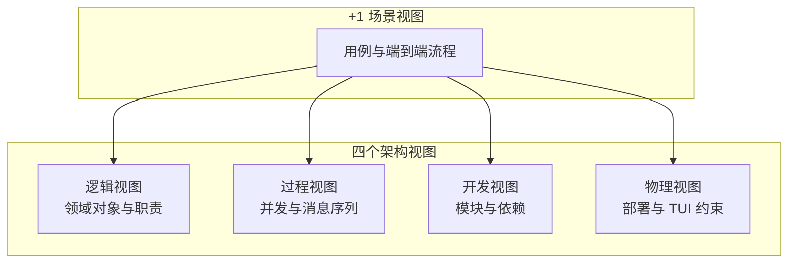
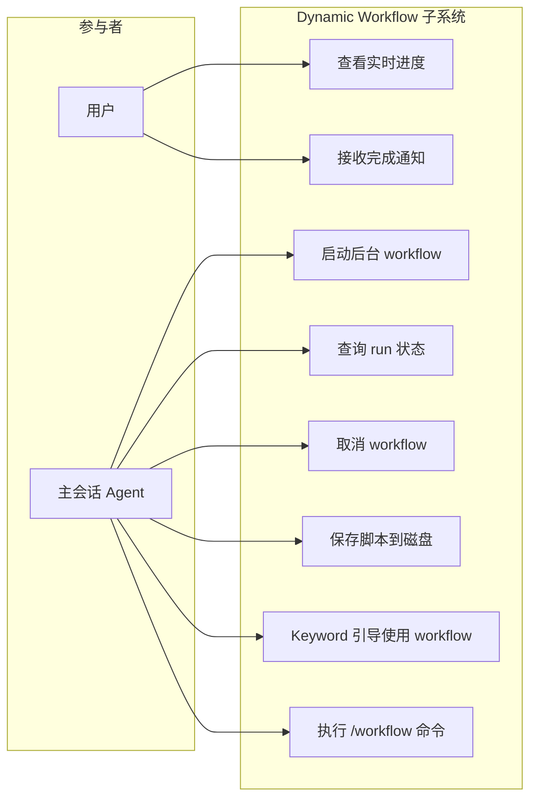
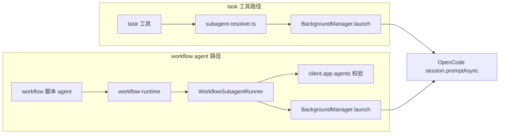
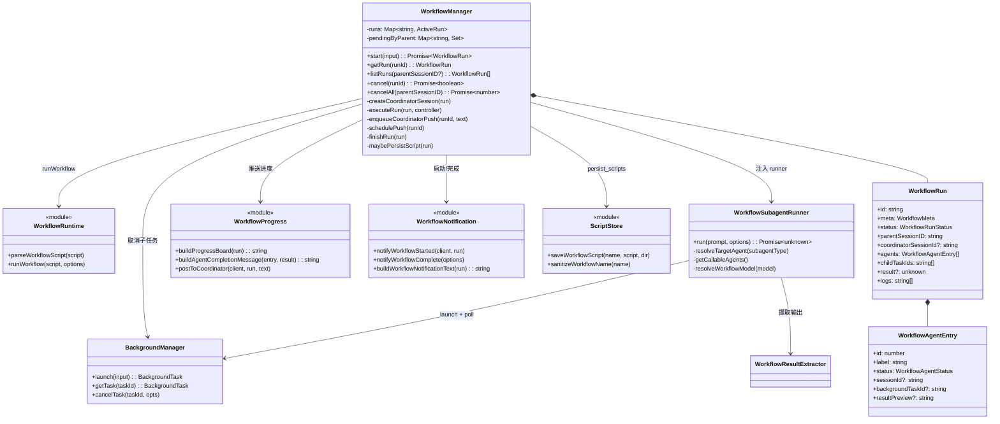
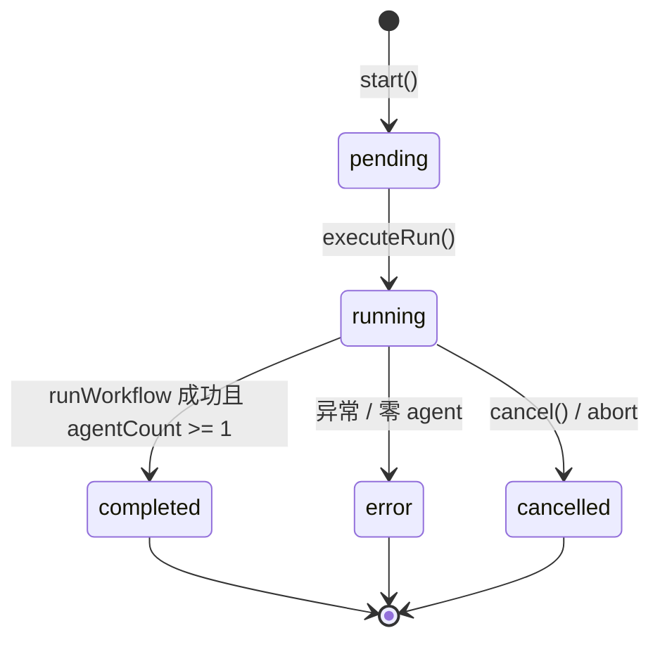
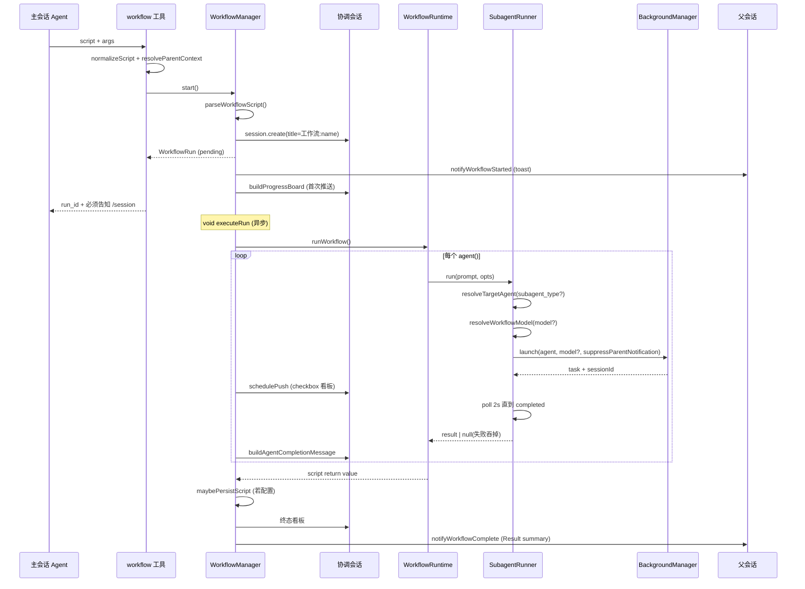
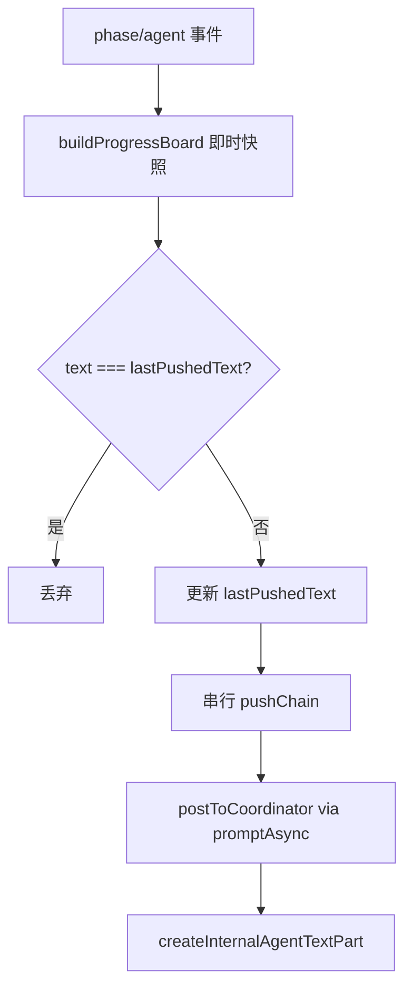
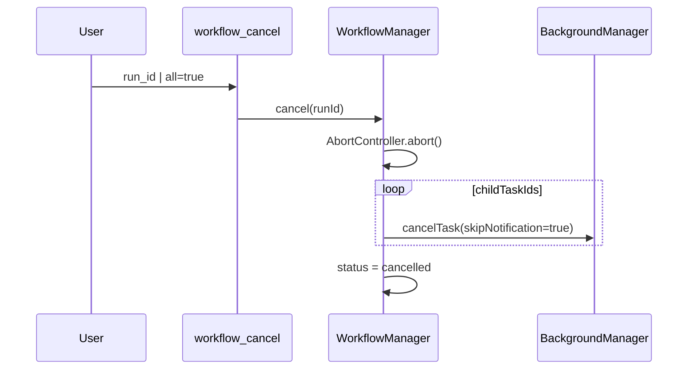
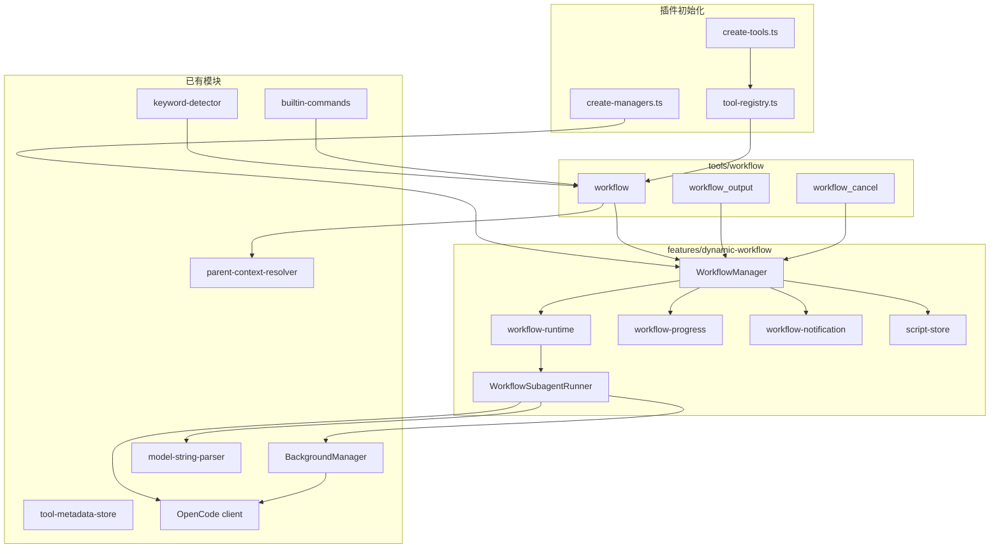
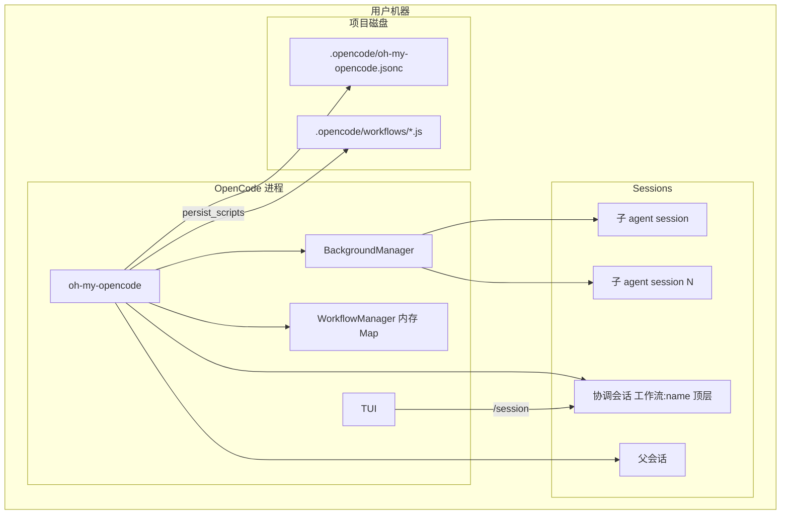

# Dynamic Workflow 架构说明

**状态:** 已实现  
**日期:** 2026-06-05  
**参考:** [Claude Code Dynamic Workflows](https://code.claude.com/docs/en/workflows)、[pi-dynamic-workflows](https://github.com/earendil-works/pi-dynamic-workflows)

---

## 1. 概述

Dynamic Workflow 是 oh-my-opencode 插件中的**脚本驱动多子代理编排**子系统。主 Agent 通过 `workflow` 工具提交 JavaScript 编排脚本；脚本在 VM 沙箱中执行，默认后台运行并立即返回 `run_id`；运行期间用户通过 `/session` 打开独立协调会话查看实时 checkbox 进度；workflow 结束时向父会话发送一条汇总通知。

编排写在脚本里（`agent` / `parallel` / `pipeline` / `phase`），中间结果通过 JavaScript 变量在编排层传递，最终 `return` 值进入完成通知。

### 1.1 设计约束

| 约束 | 说明 |
|------|------|
| 协调会话 | 必须是顶层 session（无 `parentID`），否则 TUI `/session` 列表不可见 |
| workflow 工具卡 | OpenCode TUI 仅 `task` 工具卡可点击；workflow 进度入口为 `/session` |
| 子代理通知 | `suppressParentNotification: true`，避免每个子 agent 单独通知父会话 |
| 子代理父会话 | 挂协调会话（`coordinatorSessionId`），非发起 workflow 的主会话 |
| 路由独立 | workflow 的 `agent()` **不经** `delegate-task/subagent-resolver`，仅底层共享 `BackgroundManager.launch` |
| 内存态 | `WorkflowManager.runs` 为进程内 Map，重启后旧 run 不可查 |

---

## 2. UML 4+1 架构视图

Philip Kruchten 4+1 模型：**逻辑、过程、开发、物理** 四视图 + **场景** 视图贯穿验证。



---

### 2.1 +1 场景视图（Scenarios）

#### 2.1.1 用例图



#### 2.1.2 核心场景：后台启动并查看进度

| 步骤 | 参与者 | 动作 |
|------|--------|------|
| 1 | MainAgent | 调用 `workflow(script, args)` |
| 2 | System | 解析脚本、创建 `WorkflowRun`、创建协调会话 |
| 3 | System | 返回 `run_id`；toast 提示 `/session` |
| 4 | MainAgent | **必须**告知用户：输入 `/session` 打开「工作流: \<name\>」 |
| 5 | User | `/session` → 选择协调会话 → 查看 checkbox 看板 |
| 6 | System | phase/agent 变化时推送进度；agent 完成时推送完整结果 |
| 7 | System | run 终态 → 父会话一条通知（含 `return` 摘要）+ 完成 toast |

#### 2.1.3 场景：`workflow` 的 `agent()` vs `task` 工具

两者不共用 `delegate-task/subagent-resolver.ts`；仅在最底层共享 `BackgroundManager.launch`。



| 维度 | `task`（delegate-task） | `workflow` 脚本 `agent()` |
|------|-------------------------|------------------------------|
| 编排者 | 主 Agent 每轮决策 | JS 脚本（确定性） |
| 子 agent 校验 | `resolveSubagentExecution` + 自定义扩展 | `WorkflowSubagentRunner.resolveTargetAgent` |
| 可用 agent 来源 | `client.app.agents()` | 同上（运行时，非内置枚举） |
| 默认 agent | 由 category / subagent_type 决定 | `general`（可配置 `default_subagent`） |
| category 模型链 | 8 类 category 解析 | 无；可选 `opts.model` 直接覆盖 |
| 进度入口 | 工具卡片可点击 | `/session` 协调会话 |
| 父子 agent 关系限制 | 可在 subagent-resolver 中实现 | 当前未接入 |

#### 2.1.4 场景：脚本内 task 间传参

整个 `script` 在**同一个** async IIFE + VM 上下文中执行。子 agent 之间无共享内存，通过 JavaScript 变量在编排层传递：

```js
const inventory = await agent("scan repo", { label: "scan", subagent_type: "explore" })
const summary = await agent("Summarize:\n" + inventory, { label: "summary" })
return { inventory, summary }
```

- `await agent(...)` 返回值：子 agent 最终文本，或 `opts.schema` 时的解析对象；失败返回 `null`。
- 子 agent 看不到脚本变量；必须把内容写入 prompt 字符串（或 `JSON.stringify` 后拼接）。
- `parallel` / `pipeline` 的返回值可继续赋给变量做汇总。

#### 2.1.5 场景：Keyword 与内置命令

| 入口 | 触发条件 | 行为 |
|------|----------|------|
| Keyword detector | 主会话首条消息含 `workflow` 或 `ultracode` | 注入 `[workflow-mode]` 系统提示，引导使用 `workflow` 工具 |
| `/workflow` 命令 | 用户显式调用 | 注入 `WORKFLOW_TEMPLATE`，教 Agent 编写并启动脚本 |

**过滤规则（不触发）：** system directive、`<system-reminder>` 内容、internal-initiator 消息（防止完成通知回环）、非主会话。

---

### 2.2 逻辑视图（Logical View）

#### 2.2.1 类图



#### 2.2.2 `agent()` 选项（逻辑契约）

| opts 字段 | 脚本写法 | 行为 |
|-----------|----------|------|
| `label` | `{ label: "scan" }` | 进度看板显示名（建议 2–5 词） |
| `phase` | `{ phase: "Scan" }` | 覆盖当前 `phase()`；写入子 prompt |
| `subagent_type` | `{ subagent_type: "explore" }` | 路由到 `client.app.agents()` 中 `subagent`/`all` 的 agent；省略 → `default_subagent`（默认 `general`） |
| `model` | `{ model: "openai/gpt-5.4 high" }` | 可选；解析为 `{ providerID, modelID, variant? }` 传给 launch；省略 → agent 默认模型 |
| `schema` | `{ schema: { type: "object", ... } }` | 子 agent 须返回符合 schema 的 JSON；runner 解析后返回对象 |

#### 2.2.3 核心类型

```ts
interface WorkflowMeta {
  name: string
  description: string
  whenToUse?: string
  phases?: { title: string; detail?: string; model?: string }[]
}

interface WorkflowRun {
  id: string                          // wf_<uuid8>
  meta: WorkflowMeta
  status: "pending" | "running" | "completed" | "error" | "cancelled"
  parentSessionID: string
  parentMessageID: string
  parentAgent?: string
  parentModel?: { providerID: string; modelID: string }
  coordinatorSessionId?: string
  script: string
  args?: unknown
  phases: string[]
  currentPhase?: string
  logs: string[]
  agents: WorkflowAgentEntry[]
  childTaskIds: string[]
  result?: unknown                    // 脚本 return 值；undefined → summary 为空
  toolCallID?: string
}

interface WorkflowAgentRunOptions {
  label: string
  phase?: string
  schema?: Record<string, unknown>
  model?: string
  subagentType?: string               // 脚本中 snake_case: subagent_type
  signal?: AbortSignal
}
```

#### 2.2.4 状态机（WorkflowRun）



#### 2.2.5 脚本运行时全局 API

| 全局 | 签名 / 行为 |
|------|-------------|
| `agent` | `(prompt, opts?) => Promise<unknown>` — 启动子代理，失败返回 `null` |
| `parallel` | `(thunks: (() => Promise<unknown>)[]) => Promise<unknown[]>` — 并发执行函数数组，保序 |
| `pipeline` | `(items, ...stages) => Promise<unknown[]>` — 每项经多阶段串行，项之间并发 |
| `phase` | `(title: string) => void` — 标记当前阶段 |
| `log` | `(message: string) => void` — 写入 `run.logs` |
| `args` | 工具传入的 `args` 参数 |
| `cwd` / `process.cwd()` | 项目目录 |
| `budget` | `{ total, spent(), remaining() }` — runtime 已定义，**Manager 未接线** |

---

### 2.3 过程视图（Process View）

#### 2.3.1 后台启动与执行



#### 2.3.2 协调会话推送（去重）



#### 2.3.3 取消



#### 2.3.4 并发模型

| 层级 | 机制 | 默认值 |
|------|------|--------|
| 单 run 内 `agent()` 并发 | `workflow-runtime` `createLimiter` | 16（`max_concurrency`） |
| 单 run `agent()` 总数 | runtime 计数 | 1000（`max_agents_per_run`） |
| BackgroundManager 槽位 | `provider/model` 或 agent 名 | 与普通 `task` **共享** |

**失败策略：** 单路 `agent()` 失败 → 记录 log、该分支返回 `null`，run 可继续；`signal` abort → 整 run 取消。

---

### 2.4 开发视图（Development View）

#### 2.4.1 模块结构

```
src/features/dynamic-workflow/
  index.ts                      # barrel 导出
  types.ts                      # WorkflowRun, WorkflowMeta 等
  constants.ts                  # 默认值、限制、中文标题前缀
  workflow-manager.ts           # 生命周期、协调会话、推送队列
  workflow-runtime.ts           # parseWorkflowScript + runWorkflow (acorn + vm)
  workflow-subagent-runner.ts   # agent() → resolveTargetAgent + launch
  workflow-result-extractor.ts  # 子 session 输出 + schema 解析
  workflow-progress.ts          # checkbox 看板
  workflow-notification.ts      # 启动/完成通知
  script-store.ts               # .opencode/workflows/{name}.js
  *.test.ts

src/tools/workflow/
  index.ts                      # createWorkflowTools()
  create-workflow.ts            # workflow 工具
  create-workflow-output.ts     # workflow_output 工具
  create-workflow-cancel.ts     # workflow_cancel 工具
  constants.ts                  # WORKFLOW_PROMPT_GUIDELINES
  types.ts                      # 工具参数类型
  format.ts                     # 输出格式化 + metadata

src/hooks/keyword-detector/workflow/
  index.ts
  default.ts                    # ultracode|workflow 模式

src/features/builtin-commands/templates/workflow.ts
src/config/schema/dynamic-workflow.ts
```

#### 2.4.2 组件依赖图



#### 2.4.3 工具注册

- `dynamic_workflow.enabled !== false`（默认 true）时注册 3 个工具
- 受全局 `disabled_tools` 过滤
- `workflow_output` / `workflow_cancel` 在 `LOW_PRIORITY_TOOL_ORDER` 中（工具数量超 cap 时优先裁掉）

---

### 2.5 物理视图（Physical View）



#### TUI 能力矩阵

| 能力 | 支持 |
|------|------|
| `task` 工具卡片点击 | 是 |
| `workflow` 工具卡片点击 | **否** |
| 协调会话 Markdown | **否**（纯文本 checkbox） |
| 子 agent session 下钻 | **否**（完整输出推入协调会话文本） |
| `/session` 列顶层会话 | 是（协调会话必须无 `parentID`） |
| metadata 运行中热更新 | **否**（启动写一次，运行中靠协调会话推送） |

---

## 3. 工具 API

### 3.1 `workflow`

| 参数 | 类型 | 说明 |
|------|------|------|
| `script` | string | 原始 JS，无 markdown fence |
| `args` | any? | 脚本全局 `args` |
| `run_in_background` | boolean? | 默认 `true` |

**后台模式：** 立即返回 `run_id`；禁止阻塞轮询 `workflow_output`；必须告知 `/session`。

**同步模式**（`run_in_background: false`）：工具内等待终态后返回 `formatRunResult`。

### 3.2 `workflow_output`

| 参数 | 类型 | 说明 |
|------|------|------|
| `run_id` | string | 必填 |
| `block` | boolean? | 是否等待终态 |
| `timeout` | number? | 阻塞超时（默认 60s，最大 600s） |

返回 run 状态、阶段、per-agent 进度、终态结果。仅用于用户明确要求查看中间状态，非默认等待手段。

### 3.3 `workflow_cancel`

| 参数 | 类型 | 说明 |
|------|------|------|
| `run_id` | string? | 取消指定 run |
| `all` | boolean? | 取消当前会话所有活跃 run |

---

## 4. 进度看板与通知

- **看板：** `workflow-progress.ts` 纯文本 checkbox；不用 `done/total` 分数（agent 总数动态增长）。
- **子 agent：** `suppressParentNotification: true`。
- **完成：** `notifyWorkflowComplete` 含 `Result summary`（来自脚本 `return`）；无 return 时显示 `(no result returned)`。
- **多 workflow 串行：** `pendingByParent` 确保同会话仅最后一个触发 `shouldReply`。
- **Keyword：** `workflow` / `ultracode` 仅主会话；internal-initiator 消息跳过。

---

## 5. 配置 Schema

```ts
dynamic_workflow: z.object({
  enabled: z.boolean().optional(),              // 默认 true
  max_concurrency: z.number().int().min(1).max(32).optional(),   // 默认 16
  max_agents_per_run: z.number().int().min(1).max(1000).optional(), // 默认 1000
  default_subagent: z.string().optional(),      // 默认 "general"
  notify_on_complete: z.boolean().optional(),   // 默认继承 background notification
  persist_scripts: z.boolean().optional(),      // 默认 false
  scripts_dir: z.string().optional(),           // 默认 .opencode/workflows
}).optional()
```

**接线**（`create-managers.ts`）：`WorkflowManager` 接收上述配置；`notify_on_complete` 未设置时回退到 `background_task` 通知开关。

---

## 6. Workflow 脚本契约

1. 首行：`export const meta = { name, description }`（`meta.phases` 为可选文档，非执行计划）
2. 至少一次 `agent()`；**必须以显式 `return` 结束**（completion summary 来源）
3. `parallel(() => agent(...))` 而非 `parallel([agent(...)])`
4. `opts.subagent_type` 真实路由；省略 → `general`
5. `opts.model` 可选覆盖；`provider/model` 格式，可带 variant 后缀
6. `opts.schema` → JSON Schema 结构化输出
7. 禁止 TS、`import`、`require`、`fs`、网络、`Date.now`、`Math.random`、`new Date`
8. 失败分支可能为 `null`；合成前判断
9. 可用 subagent 列表由运行时 `client.app.agents()` 决定

脚本示例：

```js
export const meta = { name: "inspect_project", description: "Inspect and summarize" }

phase("Scan")
const inventory = await agent("List main modules under " + cwd, {
  label: "repo inventory",
  subagent_type: "explore",
})

phase("Analyze")
const summary = await agent("Summarize:\n" + inventory, {
  label: "module summary",
  model: "openai/gpt-5.4 medium",
})

return { inventory, summary }
```

---

## 7. 安全

| 风险 | 缓解 |
|------|------|
| 任意代码执行 | `node:vm` + acorn AST 静态检查 |
| 原型污染 | meta 解析禁止 `__proto__` 等 |
| 资源耗尽 | `max_agents_per_run` + limiter + cancel |
| 通知注入 | 内部 `promptAsync` + 截断 + initiator marker |
| 未知 subagent | `resolveTargetAgent` 抛错并列出可用列表 |
| 非确定性 | AST 层拒绝 `Date.now` / `Math.random` / `new Date` |

---

## 8. 测试覆盖

| 文件 | 覆盖 |
|------|------|
| `workflow-runtime.test.ts` | parser、limiter、meta、`subagent_type` 透传、abort |
| `workflow-manager.test.ts` | start/cancel、协调会话、推送去重、子代理失败仍 completed |
| `workflow-subagent-runner.test.ts` | 默认 agent、`subagent_type` 路由、`model` 解析、未知 agent 报错 |
| `keyword-detector/index.test.ts` | workflow 关键词在非主会话/system-reminder/internal 通知中不触发 |

**未覆盖：** `pipeline()`、3 个 workflow 工具、`script-store`、`workflow-notification`、`workflow-progress`、`workflow-result-extractor`、keyword 正向注入。

---

## 9. 已知限制

| # | 限制 |
|---|------|
| 1 | workflow 工具卡片不可点击；进度入口为 `/session` |
| 2 | metadata 不在 run 中热更新 |
| 3 | 与普通 `task` 共享 BackgroundManager 并发槽 |
| 4 | workflow 路径未接入 delegate-task 的父子 agent 自定义校验 |
| 5 | 无跨重启 resume；run 状态仅存内存 |
| 6 | `queued` agent 状态未使用（创建时直接 `running`） |
| 7 | `budget` / `tokenBudget` runtime 已定义，Manager 与配置未接线 |
| 8 | `parentTools` 类型存在但 `create-workflow.ts` 未传入 |

---

## 10. 参考资料

- Claude Code Workflows: https://code.claude.com/docs/en/workflows
- pi-dynamic-workflows: https://github.com/earendil-works/pi-dynamic-workflows
- 实现代码：`src/features/dynamic-workflow/`、`src/tools/workflow/`
