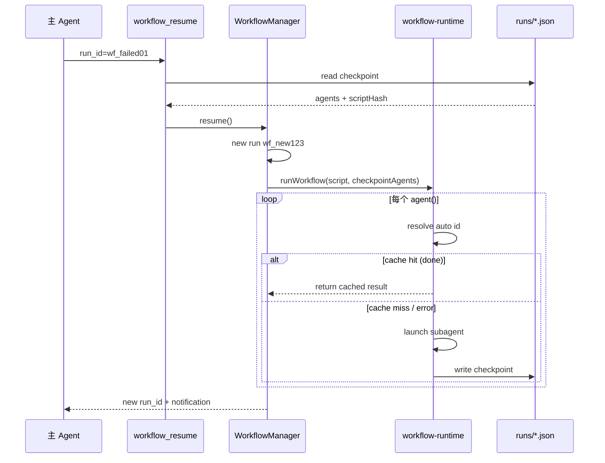

# Dynamic Workflow 续跑（Checkpoint Resume）设计

**状态:** 已实现  
**日期:** 2026-06-13  
**依赖:** [2026-06-03-dynamic-workflow-design.md](./2026-06-03-dynamic-workflow-design.md)

---

## 1. 目标

在 workflow 脚本执行失败或取消后，允许用户**从已完成步骤继续**，而无需修改脚本写法：

- 脚本仍写 `agent()` / `parallel()` / `pipeline()` / 轮询 `sleep()`，不要求手写 `id`
- 每个 `agent()` 调用自动获得稳定的 checkpoint key
- checkpoint 持久化到项目目录，进程重启后仍可续跑
- 支持 `script_path` 从磁盘加载可复用脚本

---

## 2. 核心原则

### 2.1 不在 VM 层续跑

不在 JavaScript VM 内快照局部变量、循环 PC 或调用栈。续跑语义是：

> **从头重跑脚本 + 在 `agent()` 边界 fast-forward 已完成步骤**

### 2.2 续跑粒度 = agent 调用实例

一次 `agent()` 执行（含轮询中的每一轮、parallel 的每个分支）对应 checkpoint 中的一个 entry。

---

## 3. 自动 ID 方案

### 3.1 AST 注入

`parseWorkflowScript()` 在去掉 `export const meta` 后，对每个 `agent(...)` 调用点注入 site 编号：

```js
// 作者脚本
await agent("check", { label: "poll" })

// 运行时 body（作者不可见）
await __agent(12, "check", { label: "poll" })
```

### 3.2 ID 组成

自动 ID 格式（确定性，可复现）：

```
{scriptHash16}:site{siteIndex}[:b{branchIndex}][:i{itemIndex}]:n{seq}
```

| 分量 | 含义 |
|------|------|
| `scriptHash16` | 脚本 SHA-256 前 16 位 |
| `site{N}` | AST 中第 N 个 `agent()` 调用点（从 0 递增） |
| `b{N}` | `parallel()` 分支下标（可选） |
| `i{N}` | `pipeline()` item 下标（可选） |
| `n{N}` | 同一 (site, branch, item) 下的第 N 次 invocation |

### 3.3 场景覆盖

| 场景 | ID 示例 |
|------|---------|
| 线性脚本两步 | `...:site0:n0`, `...:site1:n0` |
| while 轮询同一行 | `...:site5:n0`, `...:site5:n1`, ... |
| `parallel([() => agent(a), () => agent(b)])` | `...:site0:n0`, `...:site1:n0` |
| `parallel(items.map(i => () => agent(...)))` | `...:site5:b0:n0`, `...:site5:b1:n0` |
| `pipeline(items, stage1, stage2)` | `...:site3:i0:n0`, `...:site4:i0:n0` |

### 3.4 并行上下文

`parallel()` / `pipeline()` 通过 `AsyncLocalStorage` 注入 `{ branchIndex }` / `{ itemIndex }`，保证并发下 ID 不碰撞、且与调度顺序无关。

### 3.5 显式覆盖（可选）

`agent(..., { id: "custom-key" })` 仍可覆盖自动 ID（高级用法）。

---

## 4. Checkpoint 持久化

### 4.1 存储路径

```
.opencode/workflows/runs/{run_id}.json
```

可通过配置 `dynamic_workflow.runs_dir` 覆盖。

### 4.2 结构

```json
{
  "runId": "wf_abc12345",
  "parentRunId": "wf_failed01",
  "scriptHash": "sha256-full-hex",
  "scriptPath": ".opencode/workflows/inspect.js",
  "script": "export const meta = ...",
  "args": {},
  "status": "error",
  "meta": { "name": "...", "description": "..." },
  "currentPhase": "Analyze",
  "phases": ["Scan", "Analyze"],
  "agents": {
    "abc123:site0:n0": {
      "status": "done",
      "result": "...",
      "label": "scan",
      "phase": "Scan",
      "prompt": "..."
    }
  },
  "error": "workflow aborted",
  "updatedAt": "2026-06-13T12:00:00.000Z"
}
```

### 4.3 写入时机

- run 开始 → `status: running`
- 每个 `agent()` 完成（成功或失败）→ 更新 `agents[id]`
- run 终态 → `completed` / `error` / `cancelled`

配置 `persist_checkpoints: false` 可关闭（默认 `true`）。

### 4.4 scriptHash 校验

续跑时重新计算脚本 hash，与 checkpoint 不一致则拒绝，防止脚本变更后误用旧 checkpoint。

---

## 5. 续跑流程



### 5.1 可续跑状态

| checkpoint.status | 内存中是否 active | 可否 resume |
|-------------------|-------------------|-------------|
| `error` / `cancelled` | 任意 | 可以 |
| `running` / `pending` | 否（进程重启/会话中断） | 可以（视为 interrupted） |
| `running` / `pending` | 是（仍在执行） | 不可以（应先 cancel 或等待） |
| `completed` | 任意 | 不可以 |

续跑 interrupted run 时，旧 checkpoint 会被标记为 `cancelled`（reason: `interrupted; resumed in a new run`），新 run 写入独立 checkpoint 文件。

### 5.2 工具与内存/磁盘不一致

| 场景 | 行为 |
|------|------|
| `workflow_output(run_id)` 内存无 run | 回退读取磁盘 checkpoint 并展示进度 |
| `workflow_cancel(run_id)` 内存无 run | 将磁盘 checkpoint 标记为 `cancelled` |
| `workflow_resume(run_id)` status=running 且内存无 run | 直接续跑（无需先改 JSON） |

续跑创建**新 run_id**，`parentRunId` 指向原 run。继承原 checkpoint 中 `status: done` 的 agents，新 run 写入独立 `{new_run_id}.json`。

### 5.3 新 run 与旧 checkpoint

---

## 6. 工具 API

### 6.1 `workflow`（扩展）

| 参数 | 说明 |
|------|------|
| `script` | 内联 JS（可选） |
| `script_path` | 项目内脚本路径（可选） |
| `resume_from` | 从 run_id 续跑（可选） |
| `args` | 传入脚本的全局 `args` |

三者至少提供一个：`script` / `script_path` / `resume_from`。

### 6.2 `workflow_resume`（新增）

| 参数 | 说明 |
|------|------|
| `run_id` | 必填，要续跑的 run |
| `args` | 可选，覆盖 checkpoint args |
| `run_in_background` | 默认 true |

等价于 `workflow({ resume_from: run_id })`。

---

## 7. 配置

```jsonc
{
  "dynamic_workflow": {
    "persist_checkpoints": true,       // 默认 true
    "runs_dir": ".opencode/workflows/runs"
  }
}
```

---

## 8. 模块结构

```
src/features/dynamic-workflow/
  workflow-checkpoint.ts       # 读写 runs/*.json
  workflow-agent-id.ts         # 自动 ID + AsyncLocalStorage
  workflow-agent-transform.ts  # AST agent() → __agent(site, ...)
  workflow-script-loader.ts    # script_path + resolveWorkflowScript
  workflow-runtime.ts          # __agent + checkpoint fast-forward
  workflow-manager.ts          # 生命周期 + checkpoint 接线

src/tools/workflow/
  create-workflow-resume.ts    # workflow_resume 工具
  workflow-tool-shared.ts      # 共享启动/等待逻辑
```

---

## 9. 限制与后续

| # | 限制 |
|---|------|
| 1 | 续跑重跑整段脚本；纯 JS 逻辑（无 agent）会重新执行 |
| 2 | 修改脚本中 agent 调用顺序/数量会使 site 编号偏移，旧 checkpoint 失效 |
| 3 | `agent()` 失败仍返回 `null` 时 run 可能 `completed`；若需 fail-fast 续跑，脚本应在关键步骤检查 null 并 `throw` |
| 4 | 未持久化 JS 闭包变量；轮询/循环依赖 agent 结果缓存 + 脚本重入 |
| 5 | 嵌套 parallel 的 branch 取下层 frame（极少见） |

**后续可选：** `ctx.get/set` 显式状态、`listResumableRuns()` 暴露给工具、completed run 的 checkpoint 清理策略。

---

## 10. 测试

| 文件 | 覆盖 |
|------|------|
| `workflow-agent-id.test.ts` | 顺序/parallel/pipeline ID |
| `workflow-agent-transform.test.ts` | AST 注入 |
| `workflow-checkpoint.test.ts` | 磁盘 round-trip |
| `workflow-runtime.test.ts` | checkpoint fast-forward |
| `workflow-manager.test.ts` | 端到端 resume |

---

## 11. 参考资料

- 原始 dynamic workflow 设计：`2026-06-03-dynamic-workflow-design.md`
- 实现代码：`src/features/dynamic-workflow/`、`src/tools/workflow/`
